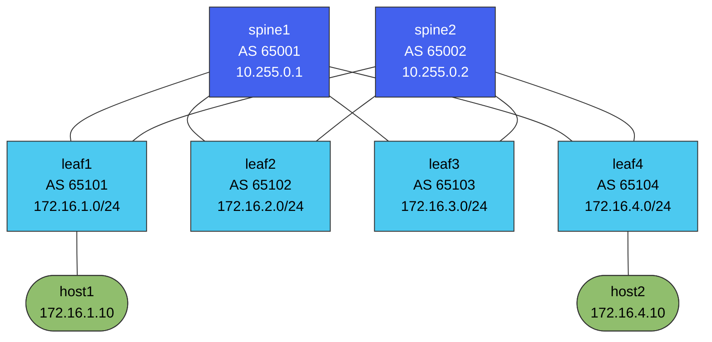

# clos01 — eBGP Leaf-Spine Fabric Lab

[](https://github.com/Raoko/netlab-clos/actions/workflows/fabric.yml)

A 2-spine / 4-leaf Clos fabric running an eBGP underlay (RFC 7938), built with
[Containerlab](https://containerlab.dev) and Nokia SR Linux, on a Proxmox host.

**Verified, not just deployed.** CI deploys the real topology on every push and
fails the build unless every BGP session establishes, `leaf1` installs **two** ECMP
next-hops, and end-to-end ping returns 0% loss.

- 📊 **[Verification output](docs/verification.md)** — real terminal output: sessions, FIB, both spines answering hop 2
- 🔥 **[Failure drill](docs/failure-drill.md)** — kill a spine uplink, next-hops go 2 → 1, **traffic never drops**
- ✅ **[Built by hand — the log](docs/hand-build-log.md)** — the same fabric typed at the CLI from an empty box, the **three faults** that kept BGP down, and what SR Linux does differently from IOS
- ✍️ **[Build it by hand](docs/hand-build.md)** — `clos-mini.clab.yml` boots three switches with **no config at all**. Same protocols, typed at the CLI, because a config you did not write is a config you cannot defend
- 🏠 **[home-netops](https://github.com/Raoko/home-netops)** — the network this runs on, plus two incident case studies: a cluster unreachable while every switch port read `1G Full`, and a gateway cutover that produced no DHCP and no error

Device configuration is **generated from a data model**, not hand-written.
`fabric.yml` is the intent; `gen_configs.py` renders it; `configs/` is build
output. This mirrors the NetBox-as-source-of-truth pattern used in production
data centers — swap `fabric.yml` for a NetBox API call and the renderer is
unchanged.

## Topology



`host1 -> host2` is the test path: **leaf1 -> spine -> leaf4**, with either spine
usable. Eight links, every leaf to every spine.

Every leaf peers with every spine. Unique ASN per device, so leaf-to-leaf
traffic transits a spine with a growing AS path and no loop suppression
surprises. Both spines are equal-cost, so `host1 -> host2` should install two
next-hops in the leaf1 route table.

## Addressing

| Plane | Scheme |
|---|---|
| P2P links | `10.0.<spine_idx>.<leaf_idx * 2>/31` — spine takes the even address |
| Loopbacks | spines `10.255.0.x/32`, leaves `10.255.1.x/32` |
| Host subnets | `172.16.<leaf>.0/24`, leaf owns `.1` |

/31s on point-to-point links (RFC 3021) — no wasted network/broadcast address.

## Run it

```bash
pip install pyyaml
python3 gen_configs.py                          # render configs/ from fabric.yml
sudo containerlab deploy -t clos.clab.yml       # bring up 6 NOS + 2 hosts
./verify.sh                                     # sessions, ECMP, end-to-end ping
sudo containerlab destroy -t clos.clab.yml --cleanup
```

Get a CLI on any node:

```bash
sudo docker exec -it clab-clos01-leaf1 sr_cli
```

## Verification checklist

- [ ] 4 established BGP sessions per spine, 2 per leaf
- [ ] `leaf1` route table shows `172.16.4.0/24` with **two** next-hops (ECMP)
- [ ] `host1` pings `host2` end to end
- [ ] Shut one spine link — traffic survives, session count drops by one
- [ ] Traceroute shows the leaf -> spine -> leaf path

## Failure drills

Do these before an interview; they're what actually gets asked.

1. `set / interface ethernet-1/1 admin-state disable` on leaf1 — watch the
   session drop, confirm ECMP collapses to one next-hop, traffic keeps flowing.
2. Break an ASN in `fabric.yml`, regenerate, redeploy — read the resulting
   error and explain why the session stays in Active/Connect.
3. Remove `172.16.0.0/12` from the export prefix-set — sessions stay up, but
   host reachability dies. Explains the difference between adjacency and
   reachability, which is the single most common interview follow-up.

## Notes and gotchas

- SR Linux `set` syntax is pinned to **24.10.1**. If a line is rejected on a
  different release, configure that one item by hand in `sr_cli` and run
  `info flat` to print the exact accepted syntax for your version, then fix the
  generator. Do not paste around the generator.
- `type: ixrd3l` is a lightweight platform variant. Drop it if your release
  complains about the model.
- Nested virtualization is not needed for SR Linux (it is a container), but
  turn it on for the Proxmox VM anyway — vJunos and other VM-based images added
  later require KVM inside the guest.

## Roadmap

- [x] Phase 1 — eBGP underlay, generated configs, verified end to end
- [ ] Phase 2 — Ansible/gNMI push instead of `startup-config`, one commit per change
- [ ] Phase 3 — NetBox as source of truth, `gen_configs.py` reads the API
- [ ] Phase 4 — gNMIc -> Prometheus -> Grafana telemetry
- [ ] Phase 5 — EVPN-VXLAN overlay on top of the underlay
- [ ] Phase 6 — Proxmox SDN EVPN across all four cluster nodes
